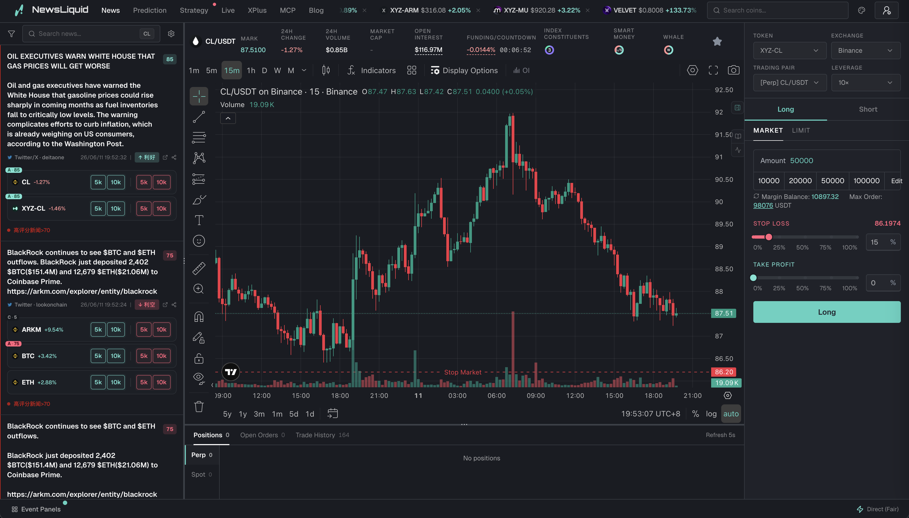

<div align="center">

# Good Product

**把值得记住的产品界面与功能，整理成可检索的公开参考库。**

[](./manifest.yaml)
[](./REGISTRY.md)

</div>

---

```
in  screenshots + product metadata + curator notes
out manifest.yaml + image corpus for the Good Product catalog

fail missing image → reject the entry before publication; every public entry needs a real screenshot
fail invalid kind/schema → reject the entry before it is published
fail sensitive/private content → stop publication and notify Park
```

Good Product 是 Park 的产品设计收藏内容仓。它按“一个产品/工具一个条目”保存一张主截图、可选的多张 gallery 截图、功能标签、适用场景、验证状态和策展人判断；网站展示由 `park-ai-intel` 负责，本仓库不负责构建或部署。

## 示例输出

当前第一条正式收藏是 NewsLiquid，三张截图分别记录交易终端、预测市场和全球事件地图：



## 如何添加一条收藏

不需要安装依赖，也不需要运行脚本。

1. 把一张主截图和可选的 gallery 截图复制到 `images/`，文件名使用小写短横线，例如 `images/gp-002-command-palette.png`。
2. 在 `manifest.yaml` 末尾追加一条记录，保持 `id`、`catalog_no` 和文件名唯一；多张图同时填入 `images` 数组，第一张也写入 `image`。
3. `kind` 只能写 `inspiration`（视觉灵感）或 `tool`（已验证工具）。
4. `tags` 使用短的英文 slug；没有来源链接时保留 `source_url: null`。
5. 检查图片不是私人/客户资料，并确认图片路径从仓库根目录可解析。
6. 点名提交并推送：

   ```bash
   git add manifest.yaml images/gp-010-command-palette.png
   git commit -m "content: add Good Product GP-010"
   git push
   ```

推送后，`park-ai-intel` 的内容刷新流程会同步 `manifest.yaml` 与 `images/`；网站不在本仓库构建。

## 字段说明

| 字段 | 说明 |
| --- | --- |
| `id` | 稳定内部 ID，例如 `gp-001` |
| `catalog_no` | 按收藏顺序展示的编号，例如 `GP-001` |
| `title` | 产品或被保存的设计判断名称 |
| `kind` | `inspiration` 或 `tool` |
| `note` | 一两句话说明为什么值得保存 |
| `tags` | 用于网站筛选的英文标签数组 |
| `image` | 相对仓库根目录的图片路径 |
| `images` | 可选的多截图数组；第一张应与 `image` 一致 |
| `collected_at` | `YYYY-MM-DD` 收藏日期 |
| `source_url` | 可选的原产品/工具链接 |

## 项目边界

- 本仓库是内容源，不是网站工程。
- 不放数据库、CMS、上传后台、Vercel 配置、构建脚本或运行时服务。
- `product-lab` 的目录归档由 Park OS canonical snapshot 生成；不要手改 `product-lab` 或 `park-operating-system`。

## For AI Agents

```yaml
name: good-product
capability:
  summary: Curated product design references as a stable YAML manifest and image corpus.
  in: screenshots + curator metadata
  out: manifest.yaml + images/
  fail:
    - missing image -> reject the entry; every public entry needs a real screenshot
    - invalid schema or kind -> reject the entry before publication
    - sensitive content -> stop publication and ask Park
source_of_truth: manifest.yaml
website_consumer: park-ai-intel /goodproduct
```

### Agent usage

```bash
# Add a new image and one manifest record, then publish the content change.
git add manifest.yaml images/gp-010-command-palette.png
git commit -m "content: add Good Product GP-010"
git push
```
